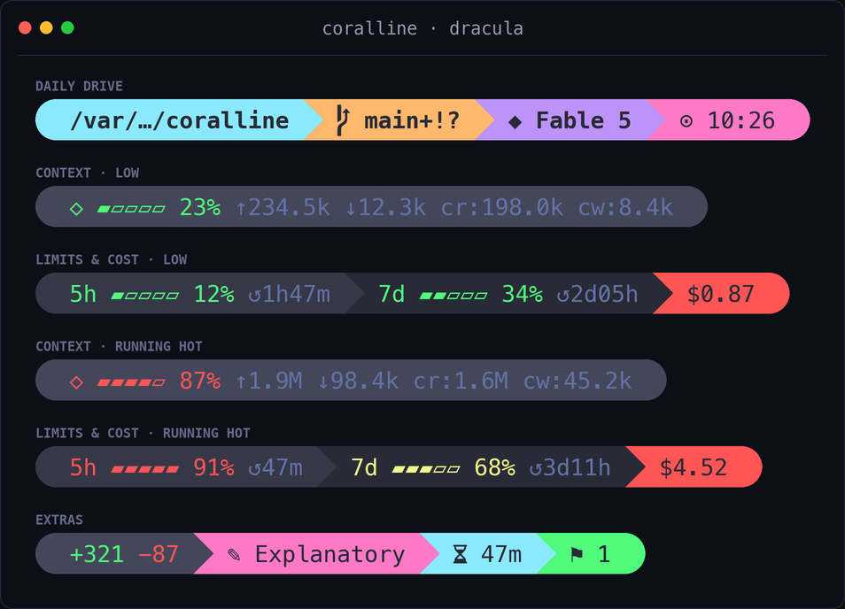

# coralline-best-themes

> 給 Claude Code 用、向 [Powerlevel10k](https://github.com/romkatv/powerlevel10k) 致敬的
> statusline，特色是**由 AI 幫你安裝**——貼一句提示詞，回答幾個配色與版面的問題，就裝好了。


> 🍴 **這是 [Nanako0129/coralline](https://github.com/Nanako0129/coralline) 的 fork**,由
> **[@kylinfish](https://github.com/kylinfish)** 維護,額外加上了**72 套主題**與一個
> **即時預覽的互動式主題選擇器**(見下方)。上游原本的引擎、安裝流程與主題全部保留——
> 這個 fork 是在它之上「加料」,不是取代。

[English README](./README.md)


## ✨ 這個 fork 新增了什麼:72 套主題 + 互動式選擇器

> **我的貢獻**([@kylinfish](https://github.com/kylinfish)):兩個新工具加一套主題包,
> 全部都能從單一調色盤表重現。上游 coralline 內建 7 套手調主題、沒有選擇器——
> 這個 fork 把總數帶到 **79 套主題**,並為 coralline 加上**首個即時預覽的互動式主題切換器**。

這個 fork 把熱門 VS Code 擴充套件
**[Best Themes Redefined](https://marketplace.visualstudio.com/items?itemName=lakshits11.best-themes-redefined)**
的調色盤移植進 coralline——**72 套開箱即用的主題**(One Dark Pro、Dracula、Night Owl、
Catppuccin、Gruvbox、Nord、Monokai、Laserwave、Horizon、Panda、Snazzy、Poimandres、Ayu、
Andromeda、Synthwave、Material、GitHub、Xcode、Shades of Purple 等等)——再加上一個
**即時互動選擇器**,讓你瀏覽全部主題並一鍵套用,完全不用手動編輯任何檔案:

```bash
bash tools/theme-picker.sh
```

```text
  coralline theme picker  —  12/79 themes
  ↑/↓ j/k 移動 · u/d 翻頁 · enter 套用 · q 離開

  preview:
  ╭ ~/proj  ⎇ main  ◆ Opus 4.8  ⬡ ▰▰▰▱▱ 62%  5h ▰▰▱▱▱ 41%  $1.23  ⊙ 02:45 pm ╮

  ▸ one-dark-pro
    night-owl
    laserwave
    shades-of-purple
```

- **即時預覽**——被選取的主題會用你自己的 `statusline.sh` 與目前的區段/版面設定,
  渲染成一條*真正的* statusline。
- **非破壞式套用**——`enter` 只會替換 `coralline.conf` 裡的主題那一行;其餘所有設定
  (區段、版面、時鐘、量表)都原封不動保留。
- **純 bash、零相依**——方向鍵 / `j` `k` 移動,`u` `d` 翻頁,`q` 離開。
- **可重現**——每套主題都由 [`tools/gen-best-themes.py`](./tools/gen-best-themes.py)
  從單一調色盤表產生,所以新增或微調一套主題只要改一處、重跑一次。

> 擴充套件的 92 個項目收斂成 72 套不重複的調色盤——Italic / Bold / Bordered / No-Italic
> 這些變體在 statusline 上顏色完全相同。少數沒有公開 hex 值的主題,是從其來源主題重建的,
> 並在檔頭標註 `# approximated`。

想看原本內建的主題請見 [主題](#主題) 章節,或直接跑選擇器。

## 安裝（有趣的方式）

把這段貼進 Claude Code：

```text
Please install coralline for me:
fetch https://raw.githubusercontent.com/kylinfish/coralline-best-themes/main/INSTALL.md
and follow the playbook in it.
```

Claude 會讓你挑主題（附預覽圖）、選擇要顯示哪些區段、決定單行或雙行版面，
然後自動完成設定並驗證。完全不需要手動編輯設定檔。

## 效果

```text
╭ ~/side-project/coralline  ⎇ main+!  ◆ Fable 5  ⬡ ▰▰▰▱▱ 62% ↑1.2M ↓45.6k  5h ▰▰▱▱▱ 41% ↺2h44m  $1.23  ⊙ 02:45 pm ╮
```

| 區段 | 顯示內容 |
|---|---|
| `dir` | 目前目錄，過長路徑摺疊為 `~/a/…/z` |
| `project` | repo 名稱（`⬢`），在所有 worktree 都相同；非 git repo 時隱藏 |
| `git` | 分支、已暫存 `+` / 已修改 `!` / 未追蹤 `?`、領先 `⇡` 落後 `⇣` |
| `model` | 目前使用的 Claude 模型 |
| `ctx` | context window 量表、輸入/輸出/快取 token 數 |
| `limit5h` / `limit7d` | 用量限額量表與重置倒數 |
| `cost` | 本次 session 花費（USD） |
| `clock` | 時鐘，12 或 24 小時制 |
| `lines` | 本次 session 修改行數 |
| `style` | 目前的 output style |
| `duration` | session 經過時間 |
| `stash` | git stash 數量 |

量表會隨用量變色：綠色 → 50% 轉黃 → 75% 轉紅（門檻可調）。

<details>
<summary><b>🚀 為什麼很快</b>——繼承自上游 coralline</summary>

statusline 就是一支本地 shell 腳本：完全不打網路、不呼叫任何 API、不消耗任何 token。
Claude Code 只是把 session 的 JSON 從 stdin 餵給它，再顯示它印出的內容。

它每秒執行一次（`refreshInterval: 1`），所以腳本在 CPU 上必須夠便宜：
單次 `jq` 呼叫一口氣取出所有欄位，單次 `git status --porcelain=v2 --branch`
同時拿到分支、檔案狀態與領先/落後數。不依賴 `bc`，也沒有逐欄位的子程序開銷。
macOS 內建的 bash 3.2 和任何 Linux bash 都能跑。

</details>

## 手動安裝

```bash
git clone https://github.com/kylinfish/coralline-best-themes ~/.claude/coralline-src
mkdir -p ~/.claude/coralline/themes/best-themes ~/.claude/coralline/tools
cp ~/.claude/coralline-src/statusline.sh ~/.claude/coralline/
cp ~/.claude/coralline-src/themes/*.conf ~/.claude/coralline/themes/
cp ~/.claude/coralline-src/themes/best-themes/*.conf ~/.claude/coralline/themes/best-themes/
cp ~/.claude/coralline-src/tools/theme-picker.sh ~/.claude/coralline/tools/
```

接著用選擇器瀏覽所有主題並套用一套：

```bash
bash ~/.claude/coralline/tools/theme-picker.sh
```

接著在 `~/.claude/settings.json` 加入：

```json
{
  "statusLine": {
    "type": "command",
    "command": "bash ~/.claude/coralline/statusline.sh",
    "refreshInterval": 1
  }
}
```

> **注意：** 需要 `jq` 以及 [Nerd Font](https://www.nerdfonts.com/) 終端機字型。
> 沒有 Nerd Font 的話，在設定檔加上 `VL_ASCII=1` 改用無特殊字符的渲染。

<details>
<summary><b>🖥️ 平台支援</b>——macOS / Linux / Windows（繼承自上游）</summary>

| 平台 | 狀態 |
|---|---|
| macOS | ✅ 支援（內建 bash 3.2 即可） |
| Linux | ✅ 支援 |
| Windows + Git Bash | ✅ 支援——有裝 Git Bash 時，Claude Code 會用它執行 statusline |
| Windows 無 Git Bash | ❌ 暫不支援——Claude Code 會退回 PowerShell，跑不了 bash 腳本（[roadmap](https://github.com/Nanako0129/coralline/issues)） |

> **Windows 提醒：** 裝 [Git for Windows](https://git-scm.com/download/win)（內含 Git Bash）和 `jq`，
> coralline 即可原生運作。給「無 Git Bash」情境的原生 PowerShell 版本列在 roadmap 上。渲染流程
> 特意設計成在 Git Bash 模擬的 `fork()` 下仍便宜——一個 `jq`、一個 `git`，沒有逐欄位的子程序開銷。

</details>

<details>
<summary><b>⚙️ 設定、響應式版面與 lean 風格</b>——完整參考，繼承自上游 coralline（點開）</summary>

所有設定都在 `~/.claude/coralline.conf`（純 bash，由腳本 source 進來）：

| 變數 | 預設值 | 說明 |
|---|---|---|
| `VL_STYLE` | `pill` | `pill`：powerline 膠囊 · `lean`：p10k lean 的純色文字風格 |
| `VL_LAYOUT` | `fixed` | `fixed`：每個 `VL_SEGMENTS*` 變數固定一行 · `auto`：響應式 |
| `VL_MAX_LINES` | `3` | 僅 `auto`——最多折成幾行（`1` = 永不折行） |
| `VL_WRAP_MARGIN` | `4` | 僅 `auto`——右側預留的欄數，避免 segment 貼到視窗邊緣 |
| `VL_SEGMENTS` | `dir git model ctx limit5h limit7d cost clock` | 第一行的區段與順序（`auto` 模式下為完整清單） |
| `VL_SEGMENTS2` / `VL_SEGMENTS3` | （空） | 僅 `fixed`——可選的第二、三行 |
| `VL_CLOCK` | `12h` | `12h` / `24h` / `off` |
| `VL_CLOCK_SECONDS` | `1` | 時鐘是否顯示秒數 |
| `VL_BAR_WIDTH` | `5` | 量表寬度（格數） |
| `VL_PATH_DEPTH` | `4` | 路徑超過此深度即摺疊 |
| `VL_NAME_MAX` | `0` | `project` / `git` 名稱超過此字數即以 `…` 截斷（`0` = 關閉） |
| `VL_COST_DECIMALS` | `2` | 費用顯示的小數位數 |
| `VL_WARN_PCT` / `VL_HOT_PCT` | `50` / `75` | 量表變色門檻 |
| `VL_ASCII` | `0` | 設為 `1` 停用 Nerd Font 字符 |
| `VL_BG_*` / `VL_FG_*` | 依主題 | 顏色——256 色編號或 `"R,G,B"` |

### 響應式版面

設定 `VL_LAYOUT="auto"` 後，視窗夠寬時整條維持單行，變窄時以貪婪法折行，
最多折成 `VL_MAX_LINES` 行。達到行數上限後，剩餘區段會溢出在最後一行。
`VL_WRAP_MARGIN` 會在右側預留幾欄空間，讓折行後的內容不貼到視窗邊緣——
若你的終端機有額外 padding，可以把它調大。

寬度來自 `$COLUMNS`。Claude Code v2.1.153+ 會在執行 statusline 前把 `COLUMNS`
設成當前終端寬度，所以折行會隨視窗縮放自動反應、開箱即用。在 Claude Code 以外，
腳本會退而用控制終端機的 `stty size`；兩者都拿不到時保持單行。

```text
wide window:    ~/dev/app  ⎇ main  ◆ Fable 5  ⬡ ▰▰▰▱▱ 62%  5h ▰▰▱▱▱ 41%  $1.23  ⊙ 14:45

narrow window:  ~/dev/app  ⎇ main  ◆ Fable 5
                ⬡ ▰▰▰▱▱ 62%  5h ▰▰▱▱▱ 41%  $1.23  ⊙ 14:45
```

偏好完全固定的版面就維持 `VL_LAYOUT="fixed"`，
用 `VL_SEGMENTS` / `VL_SEGMENTS2` / `VL_SEGMENTS3` 釘住每一行。

### Lean 風格

偏好 Powerlevel10k 的 *lean* 簡潔路線——不要背景、只要純色文字？設定
`VL_STYLE="lean"`，每個區段的 `VL_BG_*` 顏色就會變成它的文字強調色：


| 變數 | 預設值 | 說明 |
|---|---|---|
| `VL_STYLE` | `pill` | 設為 `lean` 切換成簡潔風格 |
| `VL_LEAN_SEP` | （空） | 區段之間的額外分隔字串，例如 `·` |
| `VL_LEAN_FG` | （空） | 強制指定文字色；留空 = 繼承各區段的強調色 |

> **提示：** 本來就是 p10k 使用者？跟 AI 安裝員說一聲，它會讀你的 `~/.p10k.zsh`，
> 把風格、配色、時間格式都搬過來。詳見
> [INSTALL.md 的 Powerlevel10k 匯入步驟](./INSTALL.md#step-25--powerlevel10k-import-optional)。

</details>

## 主題

| | |
|---|---|
| **`claude-coral`** — 鋼藍 · 木槿紫 · Claude 珊瑚紅（預設）<br> | **`catppuccin-mocha`** — 深底粉彩<br> |
| **`nord`** — 北極冷霜<br> | **`gruvbox-dark`** — 溫暖復古<br> |
| **`tokyo-night`** — 深藍霓虹<br> | **`mono`** — 灰階極簡<br> |
| **`dracula`** — 青 · 粉 · 紫，Dracula 暗炭底<br> | |

主題就只是一個指定 `VL_BG_*` / `VL_FG_*` 的 `.conf` 檔——複製一份、改顏色、
在 `coralline.conf` 裡改 source 你的版本即可。歡迎發 PR 貢獻新主題。

**此外還有 [`themes/best-themes/`](./themes/best-themes) 裡移植的 72 套主題**——用
[互動式選擇器](#-這個-fork-新增了什麼72-套主題--互動式選擇器)即可瀏覽並套用全部:
`bash tools/theme-picker.sh`。

> **提示：** 預覽圖是由 [`tools/render-screenshots.py`](./tools/render-screenshots.py)
> 直接執行真實腳本產生的——新增主題後把名稱加進該檔的 `THEMES` 清單再跑一次，
> 就會得到一張風格一致的預覽圖。

## 致敬與致謝

coralline 的視覺語言——膠囊化的區段、powerline 轉場、git 的 `⇡⇣` 符號、
隨用量變色的量表——是對 [@romkatv](https://github.com/romkatv) 的
[Powerlevel10k](https://github.com/romkatv/powerlevel10k) 的致敬之作，
它定義了「又快又美的 prompt」應有的樣子。也感謝開創這一切的
[powerline](https://github.com/powerline/powerline) 系譜，以及讓膠囊外型成為可能的
[Nerd Fonts](https://www.nerdfonts.com/)。

至於名稱：珊瑚藻（coralline algae）以一層層纖薄的色彩堆出礁岩——
而 **coral·line** 正是這個專案的本體：一條 Claude 珊瑚色的線。

## 致謝與貢獻

| 層次 | 作者 |
|---|---|
| **這個 fork**——72 套主題包、`gen-best-themes.py` 產生器,以及互動式 `theme-picker.sh` | **[@kylinfish](https://github.com/kylinfish)** |
| **coralline**——statusline 引擎、安裝流程與 7 套原始主題 | [@Nanako0129](https://github.com/Nanako0129) |
| **Best Themes Redefined**——本專案移植的來源調色盤 | [lakshits11](https://marketplace.visualstudio.com/items?itemName=lakshits11.best-themes-redefined) |
| **Powerlevel10k**——視覺語言 | [@romkatv](https://github.com/romkatv) |

## 授權

[MIT](./LICENSE)——與上游 coralline 相同。
